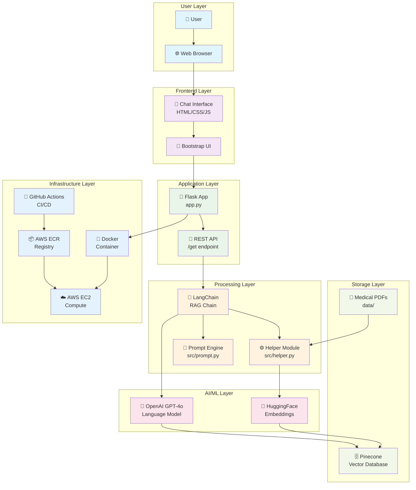
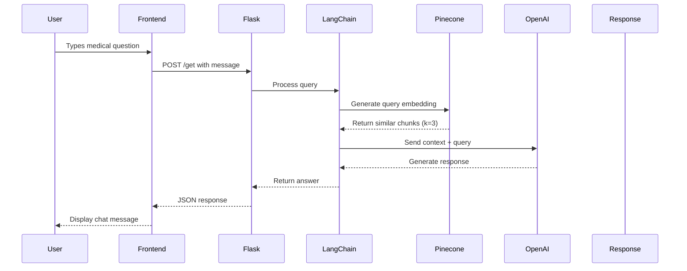
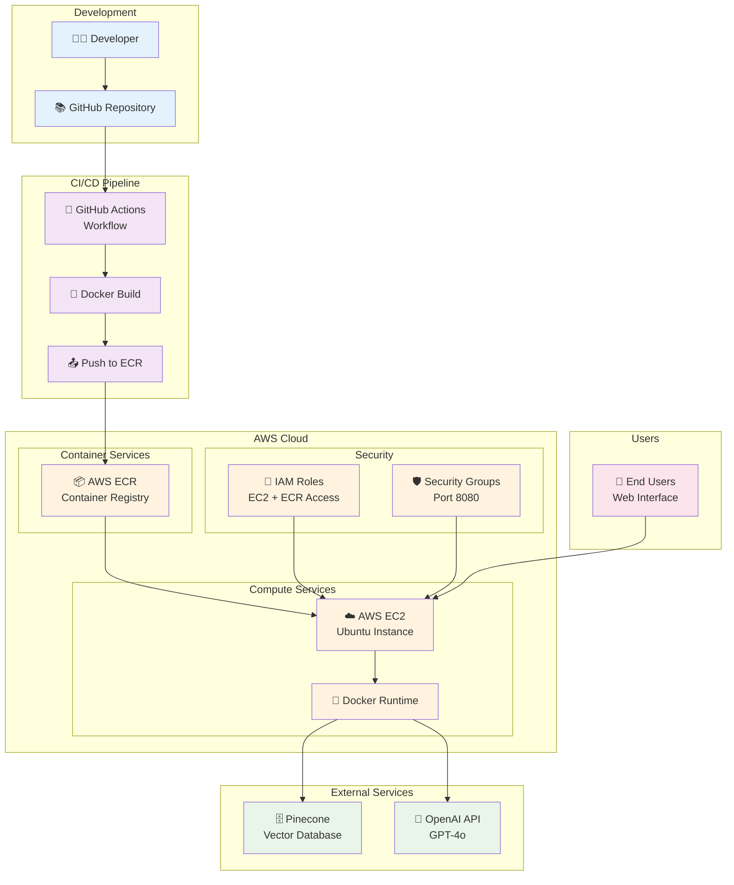
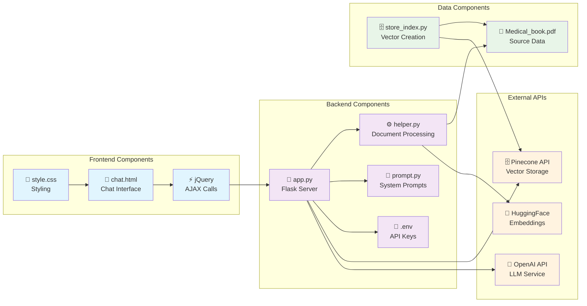
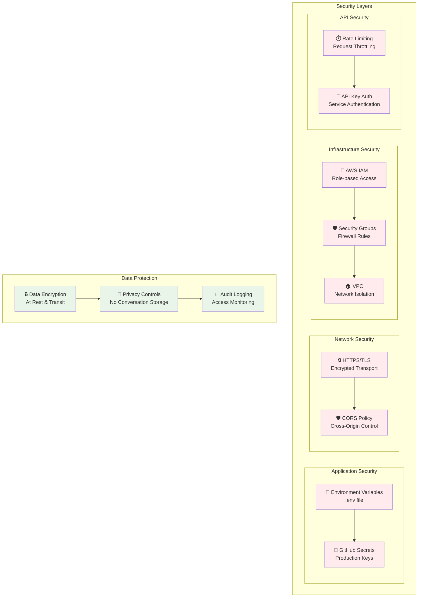
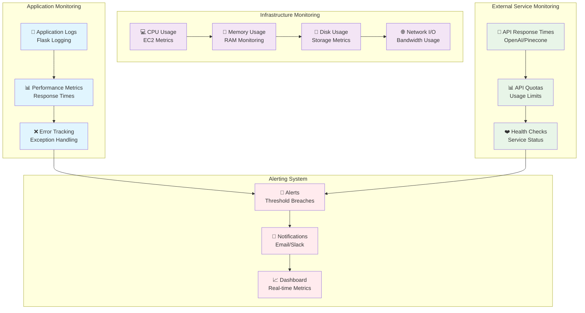

# Medical Chatbot - Architecture Diagrams

## High-Level System Architecture



## Data Flow Architecture



## Document Processing Pipeline

```mermaid
flowchart LR
    subgraph "Input"
        PDF[📄 Medical Book PDF<br/>data/Medical_book.pdf]
    end
    
    subgraph "Processing"
        LOAD[📖 PyPDF Loader<br/>load_pdfs_from_directory()]
        FILTER[🔍 Filter Metadata<br/>filter_to_minimal_docs()]
        SPLIT[✂️ Text Splitter<br/>500 chars, 20 overlap]
        EMBED[🧠 Generate Embeddings<br/>all-MiniLM-L6-v2]
    end
    
    subgraph "Storage"
        PINE[🗄️ Pinecone Index<br/>medical-chatbot<br/>384 dimensions]
    end
    
    PDF --> LOAD
    LOAD --> FILTER
    FILTER --> SPLIT
    SPLIT --> EMBED
    EMBED --> PINE
    
    classDef input fill:#e3f2fd
    classDef process fill:#f3e5f5
    classDef storage fill:#e8f5e8
    
    class PDF input
    class LOAD,FILTER,SPLIT,EMBED process
    class PINE storage
```

## RAG (Retrieval-Augmented Generation) Flow

```mermaid
graph TD
    subgraph "Query Processing"
        Q[❓ User Query<br/>"What are diabetes symptoms?"]
        QE[🔄 Query Embedding<br/>384-dim vector]
    end
    
    subgraph "Retrieval Phase"
        VS[🔍 Vector Search<br/>Cosine similarity]
        TC[📝 Top Chunks<br/>k=3 most similar]
        CTX[📋 Context Assembly<br/>Combine chunks]
    end
    
    subgraph "Generation Phase"
        SP[🎯 System Prompt<br/>Medical assistant role]
        COMB[🔗 Combine<br/>Context + Query + Prompt]
        GPT[🤖 GPT-4o<br/>Generate response]
    end
    
    subgraph "Output"
        RESP[💬 Medical Response<br/>Max 3 sentences]
    end
    
    Q --> QE
    QE --> VS
    VS --> TC
    TC --> CTX
    CTX --> COMB
    SP --> COMB
    COMB --> GPT
    GPT --> RESP
    
    classDef query fill:#e1f5fe
    classDef retrieval fill:#f3e5f5
    classDef generation fill:#e8f5e8
    classDef output fill:#fff3e0
    
    class Q,QE query
    class VS,TC,CTX retrieval
    class SP,COMB,GPT generation
    class RESP output
```

## AWS Deployment Architecture



## Component Interaction Diagram



## Security Architecture



## Performance Optimization Architecture

```mermaid
graph TB
    subgraph "Frontend Optimization"
        CDN[🌐 CDN<br/>Static Assets]
        CACHE[💾 Browser Cache<br/>CSS/JS Caching]
        COMPRESS[📦 Compression<br/>Gzip/Brotli]
    end
    
    subgraph "Application Optimization"
        ASYNC[⚡ Async Processing<br/>Non-blocking I/O]
        POOL[🏊 Connection Pooling<br/>Database Connections]
        QUEUE[📬 Message Queue<br/>Background Tasks]
    end
    
    subgraph "Database Optimization"
        INDEX[📇 Vector Indexing<br/>Optimized Search]
        BATCH[📦 Batch Processing<br/>Bulk Operations]
        REPLICA[🔄 Read Replicas<br/>Load Distribution]
    end
    
    subgraph "Infrastructure Optimization"
        LB[⚖️ Load Balancer<br/>Traffic Distribution]
        AUTO[📈 Auto Scaling<br/>Dynamic Resources]
        MONITOR[📊 Monitoring<br/>Performance Metrics]
    end
    
    CDN --> CACHE
    CACHE --> COMPRESS
    ASYNC --> POOL
    POOL --> QUEUE
    INDEX --> BATCH
    BATCH --> REPLICA
    LB --> AUTO
    AUTO --> MONITOR
    
    classDef frontend fill:#e3f2fd
    classDef app fill:#f3e5f5
    classDef database fill:#e8f5e8
    classDef infra fill:#fff3e0
    
    class CDN,CACHE,COMPRESS frontend
    class ASYNC,POOL,QUEUE app
    class INDEX,BATCH,REPLICA database
    class LB,AUTO,MONITOR infra
```



## Monitoring and Logging Architecture



---

## Diagram Legend

### Symbols Used
- 👤 User/Person
- 🌐 Web/Browser
- 🎨 Frontend/UI
- 🐍 Python/Backend
- 🤖 AI/ML Services
- 🗄️ Database/Storage
- ☁️ Cloud Services
- 🔐 Security/Authentication
- 📊 Monitoring/Analytics
- 🔄 Process/Workflow

### Color Coding
- **Blue** (`#e1f5fe`): User/Frontend Layer
- **Purple** (`#f3e5f5`): Application Layer
- **Green** (`#e8f5e8`): Processing/Storage Layer
- **Orange** (`#fff3e0`): Infrastructure Layer
- **Pink** (`#fce4ec`): AI/ML Layer
- **Red** (`#ffebee`): Security Layer

These diagrams provide a comprehensive visual representation of the Medical Chatbot architecture, showing how all components interact and the flow of data through the system.